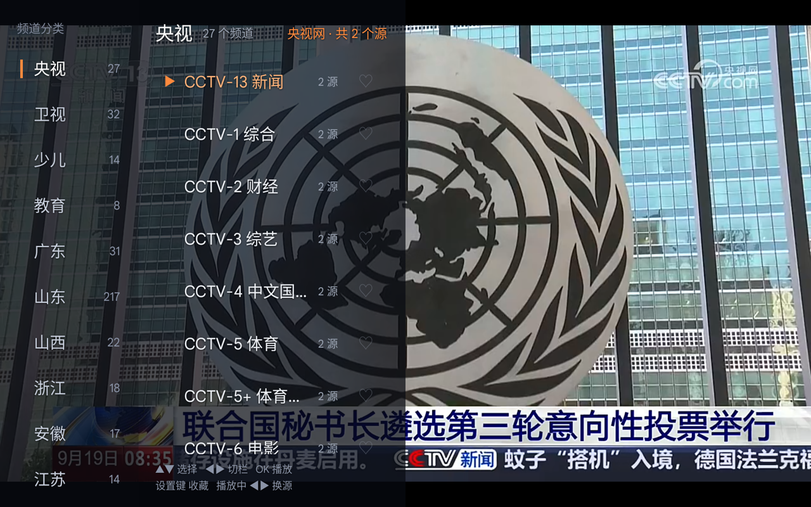
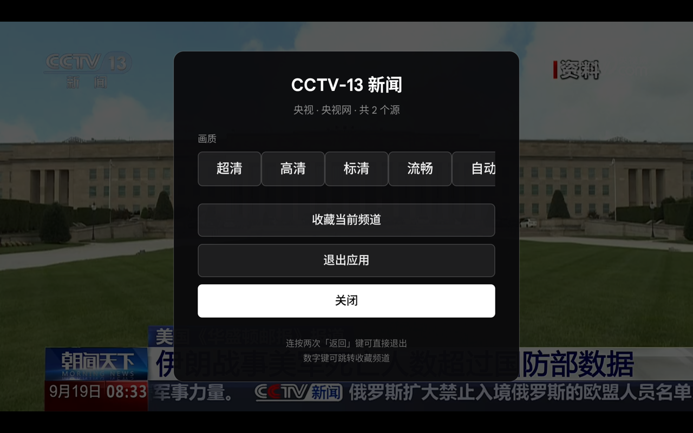

# 油桃TV / 土拨鼠大屏浏览器 APK 逆向分析报告

> 分析对象（原作者提供）：
> - `utao-20251014.apk` — 原项目最后一个版本
> - `土拨鼠大屏浏览器20260623.apk` — 作者基于同一代码库继续开发的新分支
>
> 方法：`unzip` + `aapt2 dump badging/resources/xmltree` + `jadx 1.5.x` 反编译（Java 源码 + 已解码 XML 布局）。
> 目的：评估哪些能力值得吸收进 **桃桃TV（`com.xu42.tv.live`，纯直播 / 全本地 / 单一 APK）**，
> 前提仍是「简单、易于操作」，不做无谓的功能堆砌。

---

## 一、结论速览

| # | 可汲取项 | 收益 | 成本 | 建议 |
|---|---|---|---|---|
| 1 | **沉浸式粘性全屏**（`setSystemUiVisibility(5894)`） | 高 | 约 10 行 | ✅ 强烈推荐 |
| 2 | **进后台真正停播**（暂停 video + 卸载到空白页） | 高 | 约 50 行 + 1 段 JS | ✅ 强烈推荐 |
| 3 | **菜单分层半透明底色** | 中 | 3 行 | ✅ 推荐 |
| 4 | **开机自启**（开关控制，默认关） | 中（仅电视盒子有效） | 约 40 行 | 🟡 可选 |
| 5 | 手机远控 / 手机打字 | 低（纯直播场景用不上） | 高（400+ 行 + 依赖） | ❌ 暂不建议 |
| 6 | 单列 / 双列菜单开关 | 低 | 中 | ❌ 暂不做 |
| 7 | 腾讯 X5 内核、WebView 热升级、Git 热更新 web 包 | 负 | 高（+0.5~1MB dex） | ❌ 明确不建议 |
| 8 | 崩溃上报 / 配置拉取 / 打赏二维码 | 负 | — | ❌ 不建议 |

**一句话**：土拨鼠最亮眼的是「手机远控」，但那服务于「大屏浏览器」场景；对我们「纯直播」场景真正有价值的是三个**小而确定**的体验修复（全屏、后台停播、视觉层次）。其余大件（X5、热更新、上报）恰好是我们已经砍掉的方向，不要回头。

---

## 二、两个包的基本画像

| 项目 | 油桃TV (`utao-20251014`) | 土拨鼠大屏浏览器 (`20260623`) |
|---|---|---|
| 包名 | `tv.utao.x5` | `tv.utao.x5`（同一代码库延续） |
| versionCode / Name | 47 / `2025年10月14日` | 54 / `20260623` |
| 体积 | 4.27 MB | 6.73 MB |
| minSdk / targetSdk | 16 / 28 | **21** / 28 |
| 主 Activity | `StartActivity`（MAIN+LAUNCHER） | `StartActivity`（同） |
| 其他 Activity | `MainActivity`(影视)、`LiveActivity`、`DouyinActivity` | `LiveActivity`、`TestWebViewActivity` |
| WebView 内核 | 腾讯 X5（`com.tencent.smtt`） | 腾讯 X5（同） |
| 权限 | INTERNET、ACCESS_NETWORK_STATE、ACCESS_WIFI_STATE、REQUEST_INSTALL_PACKAGES | 同上 + **CHANGE_WIFI_MULTICAST_STATE**、**RECEIVE_BOOT_COMPLETED** |
| 独有组件 | `api.vonchange.com` 配置/崩溃上报、HttpDns | **`BootReceiver`**（开机自启）、`remote.*`（手机远控） |
| dex | 5.87 MB（单 dex） | 4.87 + 0.58 MB（双 dex，含 JGit） |
| assets | 3.6 MB | 4.1 MB |

### 两者共同的「远程依赖」清单（我们已全部砍掉）

- 腾讯 **X5 内核**：`tbsall.imtt.qq.com` 下载 `.tbs`（含 32/64 位两个 MD5 校验）
- **WebView 热升级**：`com.webview.update`（下载替换系统 WebView）
- 油桃还有：`http://api.vonchange.com/utao/config/update.json`（配置拉取）、`/utao/error`（崩溃上报）、`dns.alidns.com`（HTTP DNS）

> **重要发现**：土拨鼠**自己删掉了**配置拉取和崩溃上报，只剩 `gitee.com/vonchange/marmot-tv-web.git` 一个远程地址。
> 也就是说，作者也认为「配置/上报服务端」不必要 —— 这印证了我们「零自建服务端」的方向是对的。

---

## 三、土拨鼠相对油桃的净变化

**删掉**
- `MainActivity` / `DouyinActivity`（影视入口、抖音）
- `api/`（ConfigApi）、`dns/`（HttpDns）、`call/`、`service/CrashHandler`、`util/DataCleanManager` 等
- 配置拉取、崩溃上报

**新增**
- `remote/` 包（14 个类，约 1500 行）：**手机远控**
- `adapter/ExitMenu*`、`MenuAction`、`MenuItem`（**统一菜单框架**）
- `adapter/ChannelDualAdapter`、`GroupDualAdapter`、`LoopLinearLayoutManager`（**双列菜单**）
- `receiver/BootReceiver`（开机自启）
- `helper/`（seed 释放 + JGit 拉取 web 包）
- `remote.browser.cursor.*`（远控光标）
- 沉浸式全屏、后台卸载空白页

---

## 四、土拨鼠的新特性逐个拆解

### 4.1 手机远控（`remote` 包）—— 最大新特性

**架构**

```
手机端 App                电视端（土拨鼠）
   │  UDP 广播 probe            │  DatagramSocket :19872
   ├───────────────────────────▶│  收到 "marmot_discovery_v1"+"probe"
   │◀───────────────────────────┤  回 announce{ deviceId, deviceName,
   │                            │     host, servicePort, protocolVersion,
   │                            │     remoteType, scrcpyAlive }
   │  WebSocket 连接             │
   ├───────────────────────────▶│  WebSocketServer :19889
   │  JSON 指令                  │
   └───────────────────────────▶│  BrowserRemoteCommandHandler
```

**协议常量**（`BrowserRemoteProtocol`）

| 常量 | 值 |
|---|---|
| DISCOVERY_PORT | `19872` |
| WEBSOCKET_PORT | `19889` |
| MAGIC | `marmot_discovery_v1` |
| PROTOCOL_VERSION | `1` |
| 发现报文类型 | `probe` / `announce` |

**支持的指令**（`BrowserRemoteCommandHandler`，JSON `{type, ...}`）

| 指令 | 作用 |
|---|---|
| `deviceId` / `screenInfo` / `pageInfo` | 查询设备、屏幕宽高横竖、当前页标题与 URL |
| `loadUrl` | 手机下发改网址（仅允许 http/https），可附带 `params`、`script`、`title` |
| `command` | 直接注入 JS：`webView.evaluateJavascript(script)` |
| `goBack` | 页面后退 |
| `keyEvent` / `keyCode` | 远控按键（数字 or `DPAD_UP`/`BACK`/`ENTER`/`MENU`/`SPACE` 名字 → KeyEvent 分发） |
| `move` / `tapHere` | 光标移动 / 原地点击（相对或绝对） |
| `touchDown` / `touchMove` / `touchUp` | 远控长按与拖拽（用于网页滚动、视频进度条） |
| `imeRequest` / `imeCommit` / `imeDelete` / `imeCursor` / `imeClear` / `imeEnter` / `imeDismiss` | **手机输入法 → 电视网页输入框** |

**两个实现亮点**

1. **远控光标**（`RemoteCursorController` + `RemoteCursorOverlayView`）
   - 在 Activity 根布局上动态 `addView` 一个全屏透明 View 自绘光标（圆环 + 内点，`#3BE5F6`）
   - 通过构造 `MotionEvent`（`toolType=3` 的 hover，或 `dispatchTouchEvent`）**向指定 View 派发真实手势**
   - `mapRootToTarget()`：把「根视图坐标」换算到「目标 View 坐标」，所以光标能精确点在 WebView 上
   - 5 秒无操作自动隐藏；点击时 `playTapAnimation()` 缩放 0.9→1.0 反馈
   - 菜单/弹窗显示期间（`host.isOverlayShowing()`）忽略远控点击，避免误操作

2. **手机输入法桥**（`WebViewJavascriptInputBridge`）
   - 往页面注入一段「焦点监视 + 输入合成」脚本（`installFocusMonitor`）
   - 手机每次按键 → 原生 → `evaluateJavascript` → 在页面里改写 `input.value` 并派发 `input`/`change` 事件
   - 还会**智能判断输入框用途**（`type=search`、`name/id/placeholder` 含 search/搜索/q/wd → `imeOptions=3`），让手机弹出「搜索」键盘

**为什么我们不建议照搬**

| 维度 | 评估 |
|---|---|
| 场景匹配 | 远控的核心价值是「电视上打网址/搜索」。**我们是纯直播，频道是预置的，不需要输入。** |
| 复杂度 | 约 1500 行 Java + UDP 服务 + WebSocket 服务 + 自绘光标 + 输入桥 + 一套手机端 App |
| 体积 | 需引入 `org.java-websocket`（约 150~200 KB dex） |
| 与宗旨冲突 | 明显增加「操作方式」（要装手机 App、要同 WiFi、要配对），与「简单、易于操作」相悖 |

> 如果**将来**真要支持「自定义网址」，有个比土拨鼠**更简单**的做法：电视端起一个极简 HTTP 服务，
> 设置面板显示「手机扫码 / 输入 `http://192.168.x.x:端口`」，手机用**浏览器**打开一个输入页即可 —— 手机端零安装。
> 那时再做不迟，现在不做。

---

### 4.2 菜单体系重构：统一的 `ExitMenu*` 框架

土拨鼠把「返回后弹出的菜单」抽象成数据驱动的一套框架：

```
ExitMenuBuilder  →  生成 List<MenuItem>
ExitMenuAdapter  →  RecyclerView 按 type 渲染 4 种 item
ExitMenuCallback →  Activity 实现，提供数据 + 接收点击
```

**MenuItem 的 4 种类型**：`BUTTON` / `TOGGLE` / `HZLIST`（画质横向切换）/ `DIVIDER`

**返回菜单里的条目**（`ExitMenuBuilder.build()`）
1. 「关闭返回菜单」
2. 画质（`HZLIST`，左右键切换，显示 `●高清 ○标清`，`action` 是页面 JS）
3. 「收藏 / 取消收藏当前频道」
4. 分隔线
5. 「菜单样式：双排 / 单排」（`TOGGLE`，写入 SharedPreferences `menuMode`）
6. 「下载/安装 X5 内核」（动态标题）
7. 「升级 WebView →vX.Y.Z」（动态标题）

**双列菜单布局**（`menu_dual_column.xml`）

```xml
<LinearLayout orientation="horizontal">          <!-- 铺满，透明 -->
  <RecyclerView id="groupList"   width="140dp" background="#cc000000"/>  <!-- 分类 -->
  <RecyclerView id="channelList" width="300dp" background="#aa000000"/>  <!-- 频道 -->
  <FrameLayout  id="menuBlankArea" width="0dp" weight="1"/>              <!-- 右侧留白，点击收起 -->
</LinearLayout>
```

> 📌 我们刚做的 50% 面板用的是**权重**（`menuPanel`/`menuBlank` 各 1，内部 0.52/1），
> 土拨鼠用的是**固定 dp**（140 + 300 = 440dp）。我们的方案在大屏上更自适应，保留我们的。

**导航细节（值得偷师的小技巧）**
- 分组列表按 → ：切到频道列表；频道列表按 ← ：回到分组列表
- 频道列表按 →（在某一项上）：**直接切换收藏** ⭐
- 焦点管理：`menuBlankArea` 可点（收起菜单），列表项 `focusable=true`
- 菜单弹出后 `post { requestFocus() }` 到当前项

**画质切换的设计**：`HZLIST` 只是「把 JS 片段丢给页面执行」，画质逻辑完全在网页里 —— 原生不掺和，这点和我们一致。

---

### 4.3 沉浸式粘性全屏 ⭐

```java
// LiveActivity.onResume() 与 onWindowFocusChanged(true) 都调用
getWindow().getDecorView().setSystemUiVisibility(5894);
// 5894 = HIDE_NAVIGATION | FULLSCREEN | LAYOUT_STABLE
//      | LAYOUT_HIDE_NAVIGATION | LAYOUT_FULLSCREEN | IMMERSIVE_STICKY
```

**为什么重要**：`IMMERSIVE_STICKY` 让导航栏/手势条自动隐藏且用户划出后自动再隐藏；
配合 `onWindowFocusChanged` 重复应用，才能在「切走再切回」后仍保持满屏。

**我们的现状**：`BaseActivity` 只有
```java
getWindow().setFlags(FLAG_FULLSCREEN, FLAG_FULLSCREEN);  // 只隐藏状态栏
```
**导航栏/手势条仍在**；平板和电视盒子上会露出系统 UI。

> 这是本次分析里**性价比最高**的一条：**约 10 行代码**，直接提升「大屏满屏」的观感。

---

### 4.4 后台真正停播（卸载到空白页）⭐

土拨鼠在 `onPause` / `onStop` 都会走 `y()`：

```java
// 1) 用 JS 暂停并静音页面上所有 video，断开 srcObject
"(function(){var v=document.querySelectorAll('video');
  for(var i=0;i<v.length;i++){v[i].muted=true;v[i].pause();v[i].srcObject=null;}})()"

// 2) 卸载当前页面，换成极简黑色空白页（data:text/html 内联，不走网络）
webView.loadUrl("data:text/html;charset=utf-8,%3C!doctype%20html%3E...");
```

`onResume` 时恢复：

```java
H();  // 重启远控服务
if (曾进过后台 && 后台时长 >= 2000ms) {
    postDelayed(重新 loadUrl 原频道URL, 600);   // 600ms 延迟避免闪一下
}
```

**我们的现状（且有隐患）**：

```java
// BaseActivity.onPause()
mWebView.onPause();
mWebView.getSettings().setJavaScriptEnabled(false);   // ⚠️ 对已加载页面的 JS 无效
// onStop()
mWebView.stopLoading();                                // ⚠️ 只停「正在加载」，已播放的流继续
```

`setJavaScriptEnabled(false)` 只影响**后续新页面加载**，对当前正在运行的直播流没有任何作用；
`stopLoading()` 也管不住已经跑起来的 HLS 播放器。**结果是：App 退到后台，直播仍在偷偷消耗流量、内存和解码器（甚至可能还在出声）。**

**收益**：省流量、省电、后台干净，电视盒子上尤其明显。
**成本**：约 50 行 Java + 1 段 JS。**推荐做**，同时也顺手修掉了我们现有的这个 bug。

> 细节：用 `data:text/html` 内联空白页而不是 `about:blank`，是为了确保旧页面的 JS 上下文被彻底替换。

---

### 4.5 开机自启

```java
public class BootReceiver extends BroadcastReceiver {
    public void onReceive(Context ctx, Intent it) {
        // BOOT_COMPLETED | LOCKED_BOOT_COMPLETED
        if ("1".equals(sp.getString("autoStart", "0"))) {
            Intent i = new Intent(ctx, LiveActivity.class);
            i.addFlags(FLAG_ACTIVITY_NEW_TASK);
            ctx.startActivity(i);
        }
    }
}
```

需要 `RECEIVE_BOOT_COMPLETED` 权限 + 清单声明 `directBootAware="true"`。

**评估**：对「电视 / 电视盒子」是刚需（插电即看，不需要找遥控器）。
但对**平板**要注意：Android 10+ 限制了后台启动 Activity，普通平板上大概率被系统拦掉，
只有在定制电视盒子 ROM 上可靠。**建议做成设置里的开关、默认关闭**，并如实标注生效范围。

---

### 4.6 Web 资源 seed + Git 热更新

```
APK/assets/tv-web-seed/          ← 出厂预置的网页包（含 marmot_seed.json:
   │                                {branch, commit, builtAt, source:"remote"}）
   │ 首次运行  helper/d.java 释放到 filesDir
   ▼
filesDir/tv-web/                 ← WebView 实际加载目录
   ▲
   │ helper/b.java: JGit clone/pull
   │   gitee.com/vonchange/marmot-tv-web.git  (branch=main)
   │ 拉取后 helper/c.java 保护 3 个文件不被覆盖：
   │   config/tv.yml / js/common.js / live.html
```

**评估**：这是**与「全本地零服务端」直接冲突**的机制，且 JGit 让 dex 增加约 0.5~1 MB。
我们已用 `assets/tv-web` + `WebViewClientImpl.shouldInterceptRequest` 做了等价但纯本地的实现。
**不建议采纳**。

> 唯一值得记的一点：他们用「拉取后保护 3 个文件」来解决**用户本地自定义被覆盖**的问题。
> 如果我们将来允许用户改 `tv.json`，可以参考这个「白名单保护」思路。

---

### 4.7 X5 内核 / WebView 升级

- `helper/X5DownloadHelper`：从 `tbsall.imtt.qq.com` 下载 `.tbs`（10 位十六进制 MD5 校验），曲线救国装 X5。
- `com.webview.update.*`：下载替换系统 WebView。
- 返回菜单里通过「动态标题」显示进度和状态（`WebView已下载，点击重启` 等）——**这个「一个按钮走完 下载→重试→重启」的状态机**UI 思路不错，但我们没有升级需求。

**不建议**：我们已去掉 X5，回归系统 WebView，体积从 4.3 MB 降到 782 KB。

---

## 五、与我们项目的逐项对照

| 能力 | 油桃 | 土拨鼠 | 桃桃TV 现状 | 判断 |
|---|---|---|---|---|
| 沉浸式全屏 | ❌ | ✅ | ❌ 只有 FLAG_FULLSCREEN | **建议补** |
| 后台停播 | ❌ | ✅ | ⚠️ 无效实现 | **建议修** |
| 返回键双击退出 | ✅（无时窗） | ✅（无时窗） | ✅（1.2s 时窗） | 我们更好，保留 |
| 退出面板居中卡片 | ❌ 右侧分栏 | ❌ 左右分栏 + 二维码 | ✅ 居中圆角卡片 | 我们更好，保留 |
| 双列切台菜单 | ❌ 单列 ListView | ✅（可选单/双列） | ✅（权重自适应） | 保留 |
| 频道行 ▶ 播放标记 / ♡ 收藏 | 部分 | ✅ | ✅ | 一致 |
| 分类行计数 / 焦点条 | ❌ | ❌ | ✅ | 我们更好 |
| 收藏数字键直选 | ✅ | ✅ | ✅ | 一致 |
| 画质（HZLIST）交给页面 JS | ✅ | ✅ | ✅ | 一致 |
| 多源容灾（源切换/探测） | ❌ | ❌ | ✅ | **我们独有** |
| 手机远控 | ❌ | ✅ | ❌ | 暂不建议 |
| 开机自启 | ❌ | ✅ | ❌ | 可选 |
| X5 / WebView 热升级 | ✅ | ✅ | ❌ | 不建议 |
| 配置拉取 / 崩溃上报 | ✅ | ❌ | ❌ | 方向一致 |
| Git 热更新 web 包 | ✅ (tv.utao.tv) | ✅ (gitee) | ❌ 纯本地 | 不建议 |

> 值得一提：**多源合并与容灾（`sourceRank` / `probeVideoElement` / `switchSource`）是我们独有的能力**，
> 两个原版都没有。这块我们已经领先，不要为了「对齐原作者」而退回去。

---

## 六、建议采纳清单（按优先级）

> ✅ **P0 的三项已于 2026-09-19 全部落地并在米 Pad 4 Plus 真机验证**，
> 实施细节、与原方案的偏差和实测数据见文末「[九、落地结果](#九落地结果2026-09-19-实施)」。

### P0 — 建议本轮就做（小改动、收益确定）

1. **沉浸式粘性全屏** ✅ 已完成
   - 位置：`BaseActivity` 新增 `applyImmersiveMode()`，在 `onResume()` 与 `onWindowFocusChanged(true)` 调用
   - 代码：`getWindow().getDecorView().setSystemUiVisibility(5894)`
   - 注意：`setSystemUiVisibility` 在 API 16+ 可用；若以后升 compileSdk 到 35+ 会提示废弃，可用
     `WindowInsetsControllerCompat` 兼容写法，但当前 compileSdk 34 直接调用即可
   - 预期：平板/盒子/电视真正满屏，系统 UI 不再浮动

2. **进后台真正停播** ✅ 已完成
   - `BaseActivity.onPause/onStop`：JS 暂停+静音 video → 记下当前频道 URL → `loadUrl(空白页)`
   - `onResume`：若后台时长 ≥ 2s，延迟 600ms 重新播放当前频道
   - 注意：与我们的**容灾状态机**（`loadGeneration` / `pendingUrl` / watchdog）打交道，
     恢复时要**重置 generation**，否则 watchdog 会把「主动卸载」误判成播放失败并触发换源
   - 预期：后台不再偷跑流量；顺带修掉 `setJavaScriptEnabled(false)` 的无效逻辑

3. **菜单分层半透明** ✅ 已完成
   - 左栏 `#cc000000` → 右栏 `#aa000000`，外层遮罩 `#e6000000`
   - 预期：前后层次清楚，后面直播画面透出来但不干扰阅读

### P1 — 值得做但需权衡

4. **开机自启（开关控制，默认关）**
   - `BootReceiver` + `RECEIVE_BOOT_COMPLETED` + 设置面板开关（写 SharedPreferences `autoStart`）
   - 在设置按钮文案里注明「仅电视盒子/部分电视系统生效」

### P2 — 暂不建议

5. 手机远控 / 手机输入 —— 纯直播场景用不上；将来若加「自定义网址」再考虑，且可做「手机浏览器直连」的轻量版
6. 菜单单/双列开关 —— 我们的权重双列已能覆盖
7. X5 内核、WebView 热升级、Git 热更新、配置拉取、崩溃上报、打赏二维码

---

## 七、风险与代价

| 项 | 风险 | 缓解 |
|---|---|---|
| 沉浸式全屏 | 极少数国产 ROM 对 `IMMERSIVE_STICKY` 支持不佳，可能出现闪一下 | 与 `onWindowFocusChanged` 一起用；异常时降级为 `FLAG_FULLSCREEN` |
| 后台停播 | 恢复时机与容灾状态机冲突，可能误触发换源 | 恢复前重置 `loadGeneration`；恢复期间用标志位屏蔽 watchdog |
| 后台停播 | 恢复瞬间可能有黑闪 | 沿用土拨鼠的「延迟 600ms + 后台 <2s 不重载」策略 |
| 开机自启 | Android 10+ 后台启动 Activity 被拦 | 默认关闭 + 文案说明；对电视盒子有效 |
| 引入 `org.java-websocket` | +150~200 KB dex（当前 APK 仅 782 KB，接近翻倍） | 不在 P0/P1 范围内，暂不引入 |

---

## 八、附：分析产物

解包与反编译产物（临时目录，可随时删除）：
- `/tmp/apk-analysis/utao/`、`/tmp/apk-analysis/tb/` —— 原始解包
- `/tmp/apk-analysis/jadx-utao/`、`/tmp/apk-analysis/jadx-tb/` —— 反编译源码 + 解码后的 XML 布局
- `/tmp/apk-analysis/utao-manifest.txt`、`tb-manifest.txt`、`tb-res.txt` —— Manifest 与资源表

关键源文件索引：

| 主题 | 文件 |
|---|---|
| 远控协议常量 | `remote/browser/BrowserRemoteProtocol.java` |
| 远控服务装配 | `remote/browser/BrowserRemoteService.java` |
| 远控指令处理 | `remote/browser/BrowserRemoteCommandHandler.java` |
| UDP 发现 | `remote/browser/BrowserRemoteUdpDiscoveryService.java` |
| WebSocket 服务 | `remote/browser/BrowserRemoteWebSocketServer.java` |
| 远控光标 | `remote/browser/cursor/RemoteCursorController.java` / `RemoteCursorOverlayView.java` |
| 输入法桥 | `remote/browser/input/WebViewJavascriptInputBridge.java` |
| 返回菜单框架 | `adapter/ExitMenuBuilder.java` / `ExitMenuAdapter.java` / `ExitMenuHelper.java` / `MenuItem.java` |
| 双列菜单布局 | `res/layout/menu_dual_column.xml` |
| 主界面与全屏/后台逻辑 | `LiveActivity.java`（`onResume` / `onWindowFocusChanged` / `y()`） |
| 开机自启 | `receiver/BootReceiver.java` |
| Web 包 seed / Git 同步 | `helper/b.java`、`helper/c.java`、`helper/d.java`、`assets/tv-web-seed/marmot_seed.json` |

---

## 九、落地结果（2026-09-19 实施）

P0 三项已全部实现并**在米 Pad 4 Plus（1920×1200，Android 14）真机验证通过**。
APK：`taotao-tv-20260919.0835.apk`，**788 KB**（改动前 784 KB，+4 KB）。

### 9.1 沉浸式粘性全屏 ✅

`BaseActivity`：

```java
private static final int IMMERSIVE_FLAGS = 5894;   // IMMERSIVE_STICKY|HIDE_NAVIGATION|FULLSCREEN
                                                   // |LAYOUT_STABLE|LAYOUT_HIDE_NAVIGATION|LAYOUT_FULLSCREEN

@SuppressWarnings("deprecation")
protected void applyImmersiveMode() {
    try { getWindow().getDecorView().setSystemUiVisibility(IMMERSIVE_FLAGS); }
    catch (Throwable t) { /* 降级：只隐藏状态栏 */ }
}

@Override public void onWindowFocusChanged(boolean hasFocus) {
    super.onWindowFocusChanged(hasFocus);
    if (hasFocus) applyImmersiveMode();
}
```

调用点共 3 处：`onCreate()`（避免启动瞬间露状态栏）、`onResume()`、`onWindowFocusChanged(true)`。
原 `FLAG_FULLSCREEN` 保留作为降级路径。

> 实测：截图为 1920×1200 全屏画面，**状态栏与手势导航条均已消失**，视频edge-to-edge。

### 9.2 进后台真正停播 ✅

新增两个可覆盖钩子（`BaseActivity`），把「停播」这件事交给持有状态机的子类：

```java
protected void onEnterBackground() { }                    // onStop 里调（isFinishing() 时跳过）
protected void onLeaveBackground(long backgroundMillis){}  // onResume 里调，带后台时长
```

`LiveActivity` 的实现分三步：

1. **静音**：`evaluateJavascript(JS_MUTE_ALL_VIDEO)`，把页面内（含同源 iframe 内）的 `video` 全部
   `muted = true; pause()` —— 避免卸载前留一截声音；
2. **250 ms 后卸载**：`loadGeneration++`、清 `pendingUrl`、撤掉 watchdog / 视频探测 / 加载遮罩，
   再 `stopLoading()` + `loadUrl("about:blank")`。**这 250 ms 就是「快速切走又切回」的免重载窗口**，
   期间回前台会 `removeCallbacks` 直接取消，画面原样还在；
3. **回前台重载**：后台 ≥ 2 s 时延迟 **600 ms**（等窗口稳定，避免黑闪），否则立即，
   然后 `startLoad(currentSourceIndex, false)` 走完整流程 —— 遮罩、看门狗、自动换源都照常工作。

顺带修掉了报告里指出的无效实现：`onPause()` 里的 `setJavaScriptEnabled(false)` 已删除。

**⚠️ 实施中发现的坑（必须的两处守卫）**：`loadUrl("about:blank")` 会触发正常的加载回调，
天真的实现会踩两个雷，且都是「静默错误」：

| 雷 | 现象 | 守卫 |
|---|---|---|
| `WebChromeClient.onProgressChanged` | about:blank 也走到 100% → 触发 `HistoryDaoX.updateChannel(ctx, "about:blank")`，**续播历史被写坏**（下次冷启动退化成 CCTV-1），并延时排一次视频探测 | 回调开头 `if (url.startsWith("about:")) return;` |
| `onSourceFailed` | 探测发现「页面上没有画面」→ 在后台**偷偷自动换源** | 开头 `if (unloadedForBackground \|\| pendingBackgroundUnload) return;` |

> 实测 logcat：
> ```
> LiveActivity: 进后台，卸载到空白页停播
> LiveActivity: 回前台，后台停留 4493ms，延迟 600ms 重载
> LiveActivity: 后台恢复：重载 CCTV-13 新闻 · 央视网 (1/2)
> LiveActivity: startLoad#7 source#0 https://tv.cctv.com/live/cctv13/
> ```
> 卸载后冷启动仍能续播 CCTV-13 → 历史未被污染；全程无 FATAL。

### 9.3 菜单分层半透明 ✅

`activity_live.xml`：底色从「`menuPanel` 一层近乎不透明」改为**两栏各自半透明**，
`menuPanel` 本身改为 `@android:color/transparent`（只保留吃掉点击的作用）：

| 位置 | 原 | 现 |
|---|---|---|
| `menuPanel`（左半屏基底） | `#F2070A10` | `@android:color/transparent` |
| 左栏·分类 | `#FF10151F`（完全不透明） | `#CC070A10`（80%） |
| 右栏·频道 | 继承父层 | `#B8070A10`（72%） |

**两处对原方案的偏差，都是实测后调整的**：

1. 右栏由 `#aa`（67%）提到 `#B8`（72%）—— 67% 遇到纯白画面时频道名发灰；
   报告里提到的「外层遮罩 `#e6000000`」经复核是土拨鼠**退出面板按钮**的底色，与菜单无关，故未采用。
2. 额外给菜单文字加了 **`shadowColor=#CC000000` + `shadowRadius=3` 的文字阴影**（电视端覆盖层的常规做法）——
   半透明底色不可避免会透出明亮画面，阴影比"继续加黑"更能同时保住透明感与可读性。
   落点：频道名、分类名、分类标题、频道数、源提示、底部操作提示。



### 9.4 真机验证清单

| 项 | 方法 | 结果 |
|---|---|---|
| 沉浸式全屏 | `screencap` 检查 1920×1200 是否含系统 UI | ✅ 无状态栏/导航条 |
| 后台停播 | `input keyevent HOME` → 等 5 s → `am start` | ✅ 卸载 + 延迟 600 ms 恢复 |
| 快速切回不重载 | 后台 < 250 ms 回前台 | ✅ 取消卸载，无重载 |
| 历史未被污染 | `force-stop` 后冷启动 | ✅ 仍续播 CCTV-13 |
| 后台不误换源 | 观察 logcat 有无 `onSourceFailed` | ✅ 无 |
| 菜单半透明 | 截图对比左右栏与画面透视 | ✅ 见上图 |
| 双击返回退出 | 开面板后 1.2 s 内再按返回 | ✅ 进程退出，回到桌面 |
| 设置面板居中 | 截图 | ✅ 水平垂直居中，焦点按钮反白 |



### 9.5 复现用的 adb 小抄

```bash
adb install -r app/build/outputs/apk/release/taotao-tv-*.apk
adb logcat -c && adb shell am start -n com.xu42.tv.live/.LiveActivity

# 真机截图（首次记得唤醒，否则截出来全黑）
adb shell svc power stayon true && adb shell input keyevent KEYCODE_WAKEUP
adb shell screencap -p /sdcard/s.png && adb pull /sdcard/s.png /tmp/s.png

# 平板触屏：左半屏开菜单 / 右半屏开设置面板
adb shell input tap 480 600

# 后台停播验证
adb shell input keyevent KEYCODE_HOME && sleep 5 && \
  adb shell am start -n com.xu42.tv.live/.LiveActivity

# 双击返回退出（第一次按必须处于「面板未打开」状态才会开始计时）
adb shell input keyevent KEYCODE_BACK && sleep 0.6 && \
  adb shell input keyevent KEYCODE_BACK && sleep 0.4 && adb shell input keyevent KEYCODE_BACK
```
